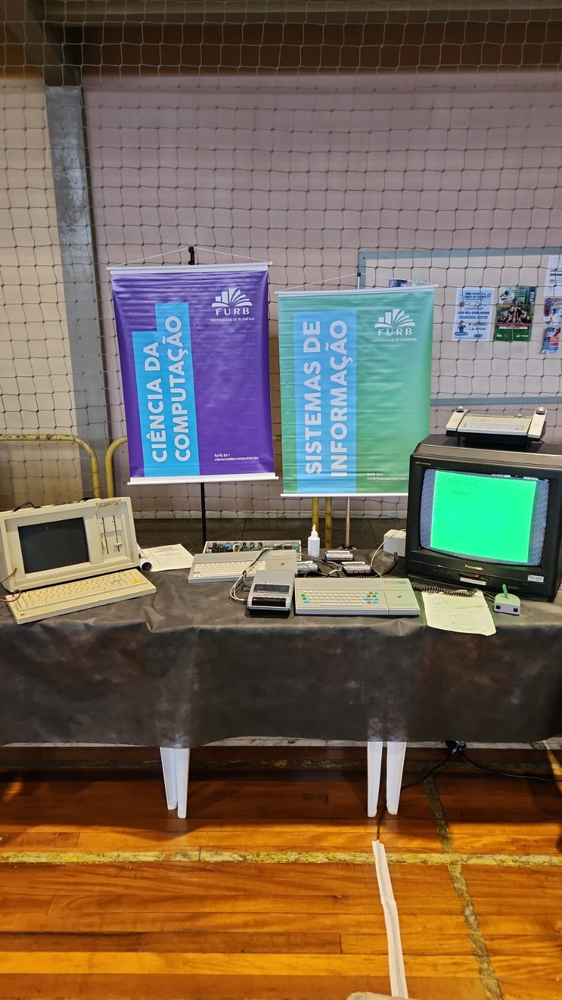

# Anotações das reuniões  

Material de TCC1: [GuilhermeSouzaDosSantos_JennyferAraujo](GuilhermeSouzaDosSantos_JennyferAraujo)  

## 2024-03-12 - 12:14

Material relacionado com museu já orientado em TCCs:
<https://github.com/gcgfurb/tcc_HenriqueDelegrego/blob/master/tcc_bcc_2023_1_HenriqueDelegrego/Textos/tcc_bcc_2023_1_HenriqueDelegrego-VF.pdf>  
<https://github.com/gcgfurb/tcc_JulioVicenteBrych/blob/master/tcc_bcc_2023_2_JulioVicenteBrych/Textos/tcc_bcc_2023_02_JulioVicenteBrych-VF.pdf>  

## 2024-03-15 - 18:01

  
[RetroSC_2.MOV](RetroSC_2.MOV)  
[RetroSC_3.mp4](RetroSC_3.mp4)  

## 2024-03-26 - 21:03

Envia a parte de contextualização. Revisei, e enviei para ajustes.  
[text](2023-03-26_PreProjeto.docx)  
